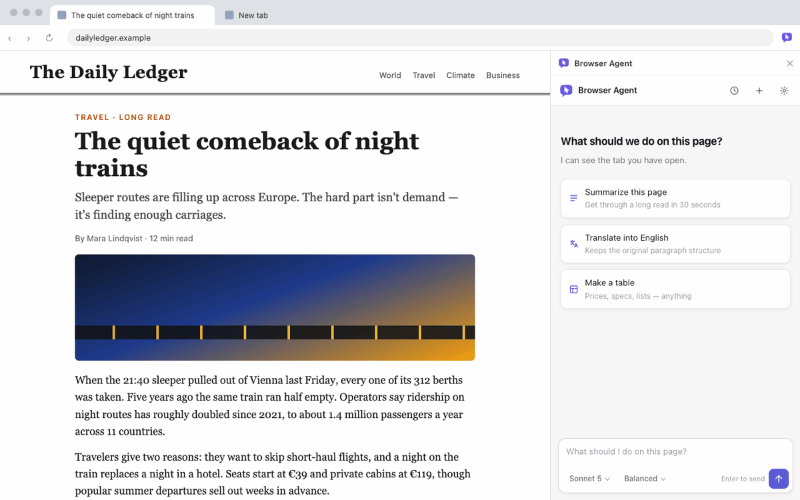
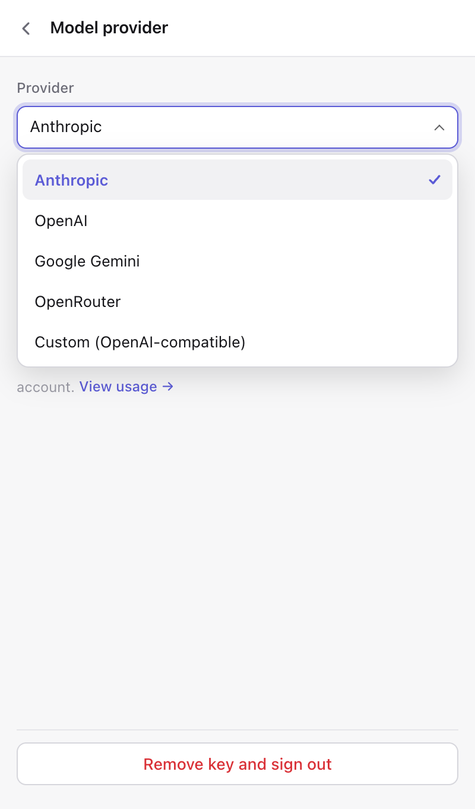
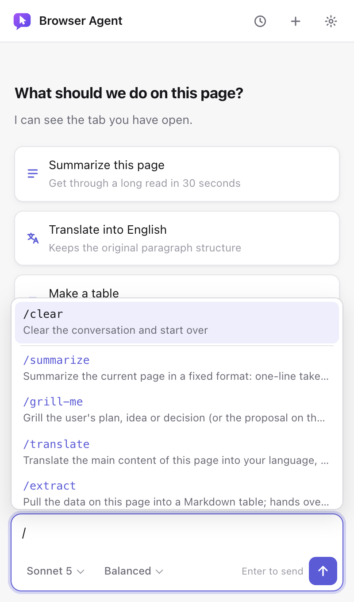
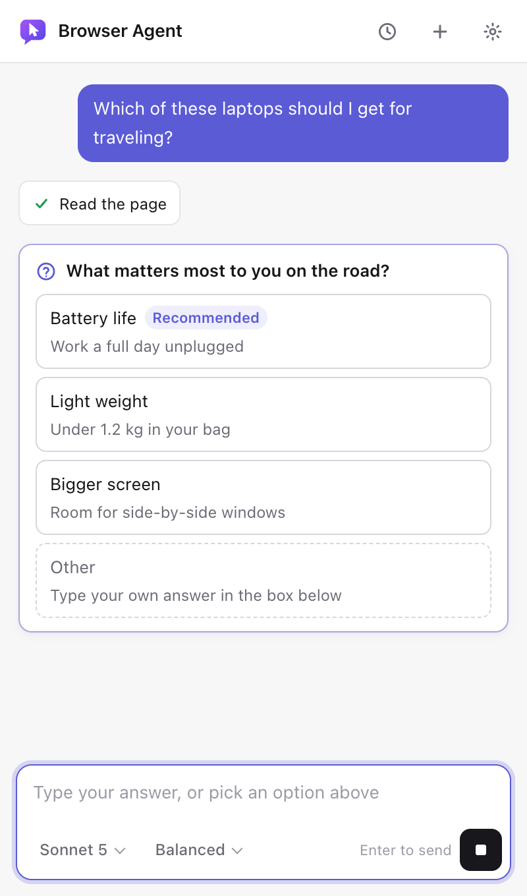
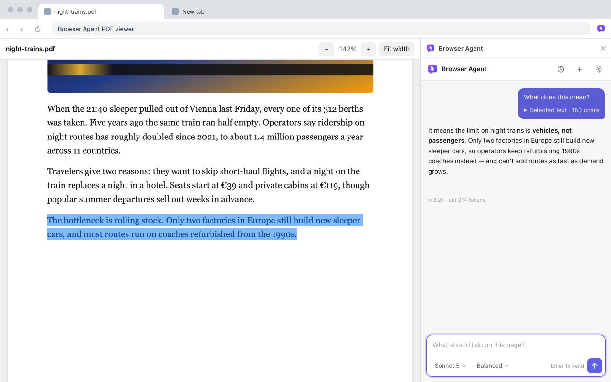

<div align="center">


# Browser Agent

**Chrome のサイドパネルに常駐する AI エージェント。開いているタブを読み取り、操作します——自分の API キー、または自分で立てたローカルモデルで。**

[](https://github.com/Wadoekeani/browser-agent/actions/workflows/ci.yml)
[](https://github.com/Wadoekeani/browser-agent/releases/latest)
[](LICENSE)


[English](README.md) · [繁體中文](README.zh-TW.md) · [简体中文](README.zh-CN.md) · 日本語 · [한국어](README.ko.md) · [Español](README.es.md) · [Français](README.fr.md) · [Deutsch](README.de.md) · [Português (Brasil)](README.pt-BR.md) · [Italiano](README.it.md) · [Русский](README.ru.md) · [Tiếng Việt](README.vi.md) · [Bahasa Indonesia](README.id.md) · [ไทย](README.th.md) · [Türkçe](README.tr.md)



</div>

## なぜ作ったか

- **今見ているページの上でそのまま動く。** 要約する、表を抜き出す、フォームに入力する、何ページかクリックして進む——チャットタブにコピペし直す必要はありません。
- **モデルは自分で選べる。** Anthropic、OpenAI、Gemini、OpenRouter、あるいは OpenAI API 互換のサービスなら何でも——自分のマシンで動かす Ollama、LM Studio、vLLM も含めて。
- **間にサーバーを挟まない。** リクエストはブラウザから選んだプロバイダーへ直接送られます。API キー、会話、メモリはすべて `chrome.storage.local` に保存されるだけ。アナリティクスもアカウントも不要です。
- **リスクのある操作は必ず確認を待つ。** 取り消せなさそうなクリックやフォーム送信は、サイドパネルで **許可** を押すまで実行されません。このチェックは拡張機能のコードそのものが強制しているもので、モデルにお願いしているだけではありません。

## 主な機能

**ページ上の操作**
- ツール:ページの読み取り、クリック、入力(`<select>` のドロップダウンも含む)、スクロール、URL を開く。モデルには操作可能な要素の番号付きリストが渡され、CSS セレクタを推測する代わりに `ref: 12` のようにクリックします。
- ページ上のテキストを選択して、その部分だけについて質問できます。送られるのはページ全体ではなく選択範囲です。
- PDF:pdf.js でテキストを抽出。内蔵ビューアーなら、普通のページと同じように PDF 内のテキストを選択できます。テキスト層のないスキャン PDF は、コストを確認したうえで Anthropic にドキュメントとして送信できます。

**会話まわり**
- テーブルやコードブロックに対応したストリーミング Markdown 返信、そして折りたたみ可能な思考過程の要約(Anthropic)。
- 質問カード(`ask_user`):モデルが判断に迷ったとき、推測ではなくクリックできる選択肢で尋ねます。
- ファイルカード:結果を `csv`、`json`、`md`、`txt`、`tsv`、`xml`、`yaml`、`ics`、`vcf` のいずれかでダウンロード可能。コピーとプレビューにも対応。
- すべての返信でトークン使用量を表示。各タスクは 30 ステップのツール呼び出しで打ち切られます。

**あなたのものとして残る**
- メモリ:「〜を覚えておいて」と伝えると、あなたに関する短い事実を会話をまたいで記憶します。設定から確認・編集・オフに切り替え可能。
- 履歴:直近 30 件の会話を日付ごとにグループ化。開いて続きから話すことも、Markdown としてエクスポートすることもできます。
- 12 個の組み込みスキルと `/` コマンド。自作するスキルは Claude Code と同じ `SKILL.md` 形式です。
- インターフェースは 15 言語に対応。ライト/ダークテーマは OS の設定に従います。

<table>
  <tr>
    <td width="33%"></td>
    <td width="33%"></td>
    <td width="33%"></td>
  </tr>
  <tr>
    <td align="center">プロバイダーを選ぶ</td>
    <td align="center"><code>/</code> でスキルを呼び出す</td>
    <td align="center">推測せずに質問してくる</td>
  </tr>
</table>



## クイックスタート

Browser Agent はまだ Chrome ウェブストアに公開されていません(近日公開予定)。それまでは、リリースビルドをそのままインストールしてください——Node.js もビルドも不要です。Chrome 122 以降が必要です。

1. [最新のリリース](https://github.com/Wadoekeani/browser-agent/releases/latest)から `browser-agent-<バージョン>.zip` をダウンロードして解凍します。
2. `chrome://extensions` を開き、右上の **デベロッパー モード** をオンにします。
3. **パッケージ化されていない拡張機能を読み込む** をクリックし、解凍したフォルダを選びます。
4. ツールバーのアイコンをクリックしてサイドパネルを開き、簡単なデータに関する通知に同意し、プロバイダーを選んでキーを貼り付けます(またはローカルのエンドポイントを入力します)。

更新するときは、新しい zip をダウンロードして同じフォルダの中身を置き換え、拡張機能カードの再読み込みアイコンをクリックしてください。設定、会話、メモリはそのまま引き継がれます。別のフォルダから読み込むと、中身が空の別インスタンスとしてインストールされます。

### ソースからビルドする

Node.js 22 以降が必要です。

```bash
git clone https://github.com/Wadoekeani/browser-agent.git
cd browser-agent
npm ci
npm run build
```

あとは手順 3 と同様に、**パッケージ化されていない拡張機能を読み込む** で `extension/` フォルダを選択してください。

## プロバイダー

| プロバイダー | 必要なもの | 備考 |
|---|---|---|
| Anthropic | [API キー](https://console.anthropic.com/settings/keys) | Sonnet 5、Opus 5、Haiku 4.5;思考の強度を選択可能;思考過程の要約;スキャン PDF に対応 |
| OpenAI | [API キー](https://platform.openai.com/api-keys) | モデル一覧はプロバイダーから取得 |
| Google Gemini | [API キー](https://aistudio.google.com/apikey) | Gemini の OpenAI 互換エンドポイントを使用 |
| OpenRouter | [API キー](https://openrouter.ai/keys) | OpenRouter 上のツール呼び出し対応モデルならどれでも |
| カスタム(OpenAI 互換) | ベース URL、キーは任意 | Ollama、LM Studio、vLLM、llama.cpp など、`/chat/completions` を持つものすべて |

ローカルサーバーは、デフォルトでブラウザ拡張機能からのアクセスをブロックします:

- **Ollama:** `OLLAMA_ORIGINS=chrome-extension://*` を設定して Ollama を再起動します(macOS:`launchctl setenv OLLAMA_ORIGINS "chrome-extension://*"`)。ベース URL は `http://localhost:11434/v1`。
- **LM Studio:** `lms server start --cors` で CORS を有効にしてサーバーを起動します。ベース URL は `http://localhost:1234/v1`。

ツール呼び出しに対応したモデルを選んでください。対応していないとページを操作できません。利用料金はプロバイダーから請求されます。拡張機能自体は無料です。

## スキル

コンポーザーで `/` を入力して選ぶか、状況に合わせてモデル自身に読み込ませることもできます。

| コマンド | 内容 |
|---|---|
| `/summarize` | 現在のページを一言の要約、ポイント、アクションアイテムにまとめる |
| `/translate` | 見出しと段落構成を保ったまま、ページをあなたの言語に翻訳する |
| `/extract` | ページ上のデータを Markdown の表に抽出。量が多いときは CSV か JSON ファイルも生成 |
| `/compare` | 価格・プラン・スペックの比較表を作り、違いを強調する |
| `/explain` | ページ、用語、コードの一部を平易な言葉で説明する |
| `/thread` | コメントスレッドを要約:主な論点、それぞれの立場、合意点、読む価値のあるコメント |
| `/reply` | ページ上のメールやメッセージへの返信を下書き。返信欄に入力することもあるが、送信は絶対にしない |
| `/fill-form` | あなたの情報でフォームに入力。足りない項目は質問し、送信前に必ず止まる |
| `/review-pr` | GitHub のプルリクエストをレビューし、深刻度ごとに問題をファイル名と行番号付きでリストアップ |
| `/checklist` | チュートリアルを手順のチェックリストに変換する |
| `/decide` | 選択肢を整理し、あなたのニーズを一つずつ確認してから、ひとつを推薦する |
| `/grill-me` | あなたの計画(またはページ上の提案)を、一度に一問の選択式で徹底的に問い詰める |

`/clear` で新しい会話を開始します。

### 自分でスキルを書く

スキルは `name` と `description` の frontmatter で始まり、その後に指示が続く Markdown ファイルです:

```markdown
---
name: meeting-notes
description: 会議のページを決定事項、アクションアイテム、担当者に整理する
---

1. read_page でページ全体を読む。
2. 決定事項をリストアップし、続けてアクションアイテムを担当者・期限つきの表にする。
```

スキルは **設定 → スキル** で管理します:作成、編集、`.md` ファイルのインポート、エクスポート。Claude Code の `SKILL.md` ファイルはそのままインポートできます。任意の `model:` 行(例:`model: haiku`)を書いておくと、Anthropic 利用時にそのスキルだけより安価な Claude モデルで実行されます。

システムプロンプトに含まれるのは名前と説明だけです。モデルは必要になったときに `use_skill` を呼び出して完全な指示を読み込み、`/名前` と入力すると直接アタッチされます。スキルはプロンプトそのものなので、インポートする前に内容を読んでおきましょう。

## セキュリティとプライバシー

**データの流れ。** ブラウザが通信する先はひとつだけ、あなたが設定したプロバイダーまたはエンドポイントです。リクエストにはあなたのメッセージ、エージェントが読み取ったページ内容(または選択範囲だけ、あるいは PDF)、保存済みのメモリ、スキル名が含まれます。API キー、会話、メモリ、スキルはすべて `chrome.storage.local` にのみ保存されます。Browser Agent 独自のサーバーはなく、アナリティクスもリモートコードもありません。初回起動時のデータ通知に同意するまで、何も送信されません。詳細は[プライバシーポリシー](store/privacy-policy.md)を参照してください。

**「許可」が必要な操作。** 以下の操作はサイドパネルにカードを表示し、**許可** を押すまで実行されません。カードは拡張機能自身のページ内にあるため、Web サイト側からクリックすることはできません:

- 取り消せなさそうなクリックやフォーム送信:ボタンの表示テキスト、`aria-label`、title、value が支払う・購入する・注文する・削除する・送信する・送る・公開する・認証する・保存する・共有する・インストールするなどに読める場合(対応する 15 のインターフェース言語すべてで判定);複数のフィールドやパスワード欄を持つフォーム;フォーム内のアイコンのみのボタン;フォームに属さないフィールド(チャット欄など)での Enter キー押下。ボタンの表示テキストと `aria-label` が食い違っている場合は、カードに警告が表示されます。
- 別のサイトへの移動(ナビゲーションでもリンククリックでも):タスク開始時のサイト、あなたがメッセージで指定したサイト、このタスク内ですでに許可したサイトのいずれかを除きます。カードにはクエリ文字列を含む完全な URL が表示されます。
- 会話の中に Web コンテンツ(読み取ったページ、PDF、選択範囲)が含まれた後にメモリを保存する場合。

ホーム画面の提案はクリックすると即座に送信されます。ページに基づいて生成される提案は、ページの内容を読んだあとに書かれるため、ページ側がその内容に影響を与えられます。提案の中で言及されたサイトはあなたが指定したサイトとしては扱われず、それによって発生する操作も同じ確認カードを通過する必要があります。返信内のリンクには、実際のドメインがテキストの横に表示されます。

**出力とファイル。** モデルの返信は DOMPurify でサニタイズしてから表示されます。画像、メディア、SVG、iframe、フォーム、インラインスタイルは取り除かれるため、ページが画像 URL 経由であなたの会話をモデルに漏らさせることはできません。生成されるファイルはプレーンテキスト形式(`csv`、`json`、`md` など)に限られ、CSV/TSV のセルがスプレッドシートの数式のように始まっている場合は無害化されます。

### 既知の制限

- **プロンプトインジェクションは解決されていません。** このエージェントはあなたのログイン済みセッションを使って Web サイトを読み取り、操作します。悪意のあるページが、あなたの会話・メモリ・他サイトのデータをどこかへ送らせたり、代わりに何かをさせたりしようと誘導してくる可能性があります。上記の確認カードは高リスクな操作をカバーしますが、完全な防御ではありません。
- 銀行、メール、会社の管理画面のタブを開いたまま、信頼できないページで実行しないでください。タスク実行中は様子を見守ってください。
- リスクの高いクリックの検出は、キーワードとフォームの形状に基づくヒューリスティックです。見逃すボタンもあります。
- 同じサイト内のフィールドへの入力は確認を求めません。悪意のあるページは(例えば `input` イベントのリスナーで)エージェントが入力した内容を読み取り、自分のサーバーへ送ることができます。
- インポートした `SKILL.md` は信頼された指示として扱われます。読んだことのあるスキルだけをインポートしてください。
- メモリと会話はブラウザ内に暗号化されずに保存され、リクエストのたびに選択したプロバイダーへ送信されます。
- 各タスクは 30 ステップのツール呼び出しで停止し、すべての返信でトークン使用量が表示されるため、暴走したループにも上限があり、可視化されています。

## 対応言語

English、繁體中文、简体中文、日本語、한국어、Español、Français、Deutsch、Português (Brasil)、Italiano、Русский、Tiếng Việt、Bahasa Indonesia、ไทย、Türkçe。デフォルトはブラウザの言語に従い、**設定 → 言語** で変更できます。モデルは、あなたが別の言語で書かない限り、インターフェースの言語で回答します。

## 開発

```bash
npm run watch      # 保存するたびに再ビルド;その後拡張機能カードの再読み込みをクリック
npm run typecheck  # tsc --noEmit
npm run check      # ユニットのセルフチェック:スキル、メモリ、履歴、ファイル、プロバイダー、i18n
npm run test:e2e   # ビルド後、モックしたモデル API に対して Playwright で拡張機能を読み込んでテスト
```

サイドパネルは React + TypeScript 製で、esbuild によって `extension/` にバンドルされます。バックエンドは存在しません:`src/agent.ts` がサイドパネル内でエージェントループを実行し、Anthropic は公式 SDK 経由で、それ以外の OpenAI 互換 API は `src/providers.ts` 経由で呼び出します。`src/tools.ts` のツールは `chrome.scripting` を使ってアクティブなタブ内で実行されます。`src/elements.ts` は番号付き要素リストと、取り消せない操作の判定を組み立てます。e2e テストは API キー不要で、費用も発生しません。

| パス | 内容 |
|---|---|
| `src/sidepanel.tsx` | エントリーポイントとメイン UI(オンボーディング、チャット、コンポーザー、`/` メニュー) |
| `src/agent.ts` | エージェントループ、設定の読み込み、デフォルトスキル、履歴の保存/復元 |
| `src/providers.ts` | プロバイダー一覧と OpenAI 互換アダプター |
| `src/tools.ts` | ツールの実装(`runTool`)と確認ゲート |
| `src/shared.ts` | システムプロンプトとツール定義 |
| `src/elements.ts` | 番号付きの操作可能要素(`data-ba` refs)とリスク判定 |
| `src/log.tsx` | チャットログ、カード、DOMPurify を使った Markdown レンダリング |
| `src/pages.tsx` | 設定、履歴、スキルエディター |
| `src/pdf.ts`、`src/viewer.ts` | PDF テキスト抽出と内蔵ビューアー |
| `src/selection.ts` | 選択テキストのチップ |
| `src/skills.ts`、`src/memory.ts`、`src/history.ts`、`src/files.ts` | `SKILL.md` パース、メモリ、履歴、ファイルカード |
| `src/i18n/` | `t()` と 15 言語分の辞書(`en.ts` が唯一の正本) |
| `extension/` | マニフェスト、`_locales/`、HTML、service worker——Chrome にはこのフォルダを読み込む |

ツールを追加するには:`src/shared.ts` の `tools` にスキーマを追加し、`src/tools.ts` の `runTool` に `case` を一つ追加します。

### 翻訳する

`src/i18n/locales/en.ts` を例えば `nl.ts` としてコピーし、`const nl: Dict = { … }` として宣言し、値を翻訳します(`{placeholder}` はすべて残してください)。そのうえで `src/i18n/index.ts` の `LANGS` とローダーに追加します。キーが不足または余分だと `npm run typecheck` が失敗し、プレースホルダーが一致しないと `npm run check` が失敗します。モデルに送られるプロンプトとツールの説明は、意図的に単一言語のまま保たれています。Chrome ウェブストアの名称と説明は `extension/_locales/<code>/messages.json` に追加してください(Chrome はアンダースコアを使うので、例えば `pt_BR`)。

## コントリビュート

Issue や PR を歓迎します。詳しくは [CONTRIBUTING.md](CONTRIBUTING.md) を参照してください。PR は小さく保ち、上記の 3 つのチェックを実行し、それらでカバーされない部分についてはどうテストしたかを書いてください。

## ライセンス

[MIT](LICENSE)。Browser Agent は独立したプロジェクトであり、Anthropic、OpenAI、Google のいずれとも提携・関連はありません。

---

<p align="center"><a href="https://iosoftware.ai"></a></p>
