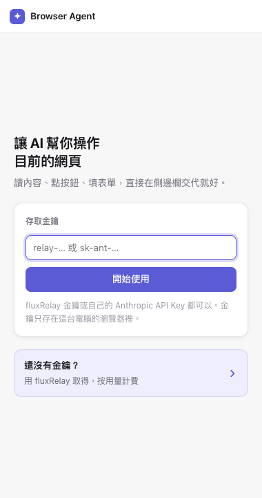
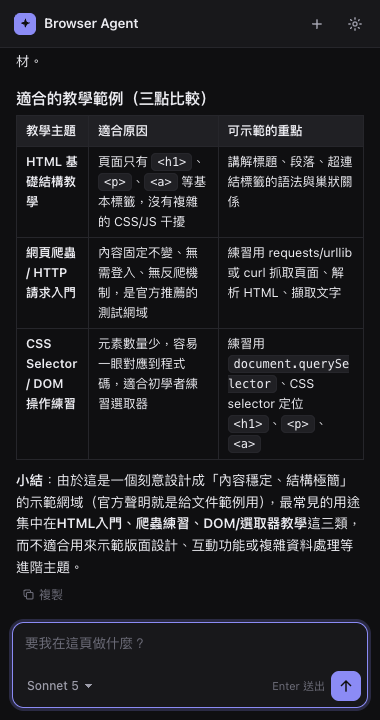

# Browser Agent

A Claude agent that lives in Chrome's side panel. It reads the page you're on, clicks, types and navigates for you — and shows its thinking along the way.

在 Chrome 側邊欄裡的 Claude agent：讀取目前分頁、幫你點擊、填表、換頁，並顯示思考過程。

<p>
  
  
</p>

## Features

- Streams replies with Markdown (tables, code blocks with copy buttons) and collapsible thinking summaries
- Page tools: `read_page`, `navigate`, `click`, `type` (also picks `<select>` options), `scroll`. `read_page elements=true` lists interactive elements with numbers, so the model clicks `ref: 12` instead of guessing CSS selectors
- Skills: reusable instructions in the same `SKILL.md` format as Claude Code — type `/` to pick one, or let the model load one when it fits
- Slash commands: `/clear` resets the conversation
- History: conversations are saved as you go (last 30, in `chrome.storage.local`) — reopen one from the clock icon and keep chatting, or export it as Markdown
- Built-in skills: `頁面摘要` (page summary) and `grill-me` (stress-tests your plan or the proposal on the page, one question at a time)
- Memory: tell it "remember …" and it keeps short facts about you across conversations (Settings → Memory to view, edit or turn off). Memories live in `chrome.storage.local` and ride along in the system prompt, so no extra round trip; only things you say yourself are stored, never text from web pages
- Runs entirely in the extension — no server of your own
- Models: Sonnet 5, Opus 5, Haiku 4.5, with an effort picker (low → max) for Sonnet / Opus
- Home suggestions generated from the page you are on (one click sends it)
- Light and dark themes

## Getting a key

Paste either key into the side panel. The prefix decides where requests go:

| Key | Goes to | Billing | Extras |
|---|---|---|---|
| `relay-…` | [fluxRelay](https://ai-gateway.iosoftware.ai/) | Pay-as-you-go on fluxRelay | Live balance in the header |
| `sk-ant-…` | Anthropic API directly | Your Anthropic account | — |

The key is stored in `chrome.storage.local` on your machine only.

## Install (from source)

```bash
npm install
npm run build        # outputs extension/sidepanel.js; use `npm run watch` while developing
```

Open `chrome://extensions`, enable **Developer mode**, click **Load unpacked**, and pick the `extension/` folder. Click the toolbar icon to open the side panel.

## Skills

A skill is a Markdown file with `name` and `description` frontmatter, followed by instructions:

```markdown
---
name: meeting-notes
description: Turn a meeting page into decisions, action items and owners
---

1. Read the whole page with read_page.
2. List decisions, then a table of action items with owner and due date.
```

Manage skills in **Settings → Skills** (create, edit, import `.md`, export). Claude Code `SKILL.md` files import as-is.
Only names and descriptions go into the system prompt; the model calls `use_skill` to load the full instructions when it needs them. Typing `/name` in the composer attaches that skill's instructions directly.

Skills are prompts — read one before importing it.

## Security notes

- Web page content is untrusted. The system prompt tells the model to ignore instructions found on pages, but prompt injection is not a solved problem — watch what it does on sensitive sites.
- Clicks that look irreversible (labels like pay / buy / delete / submit, or submitting a form with several fields or a password) pop up a confirmation in the extension itself, so a page can't talk the model out of asking. Single-field forms such as search boxes are not asked about. This is a keyword heuristic, not a guarantee.
- Each task stops after 30 tool steps, and every reply shows its token usage (plus the actual NT$ spent when using a fluxRelay key).
- Model output is sanitized with DOMPurify before rendering. Images, media, forms and inline styles are stripped, so a page can't trick the model into leaking the conversation through an image URL.

## Project layout

| Path | What |
|---|---|
| `src/sidepanel.js` | Agent loop, tool implementations, UI wiring |
| `src/shared.js` | System prompt and tool definitions |
| `src/skills.js` | `SKILL.md` parsing / serialization |
| `src/elements.js` | Numbered interactive-element list injected into the page (`data-ba` refs) |
| `src/memory.js` | Memory add / forget / prompt (`npm run check` covers both) |
| `extension/` | Manifest, side panel HTML/CSS, service worker (load this folder in Chrome) |

To add a tool: add its schema to `tools` in `src/shared.js` and a `case` in `runTool` in `src/sidepanel.js`.

## License

[MIT](LICENSE)
